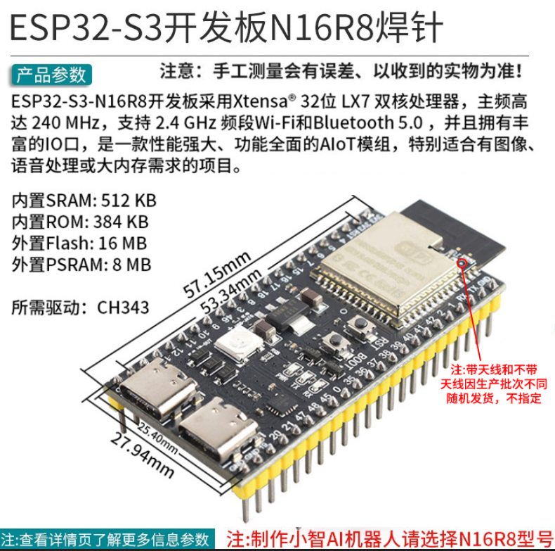

# This is a project for zephyr on esp32
first project is blinky which is created by manual every file

## Hardware
this project use esp32s3 N16R8 custom board from taobao

1. Schematic :

2. Hardware Appearance View:

